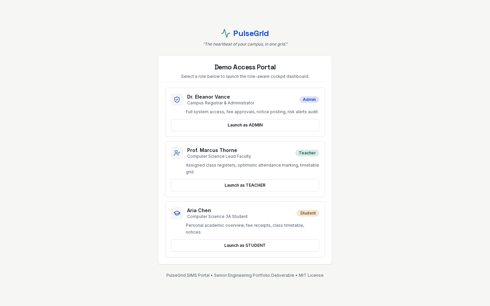
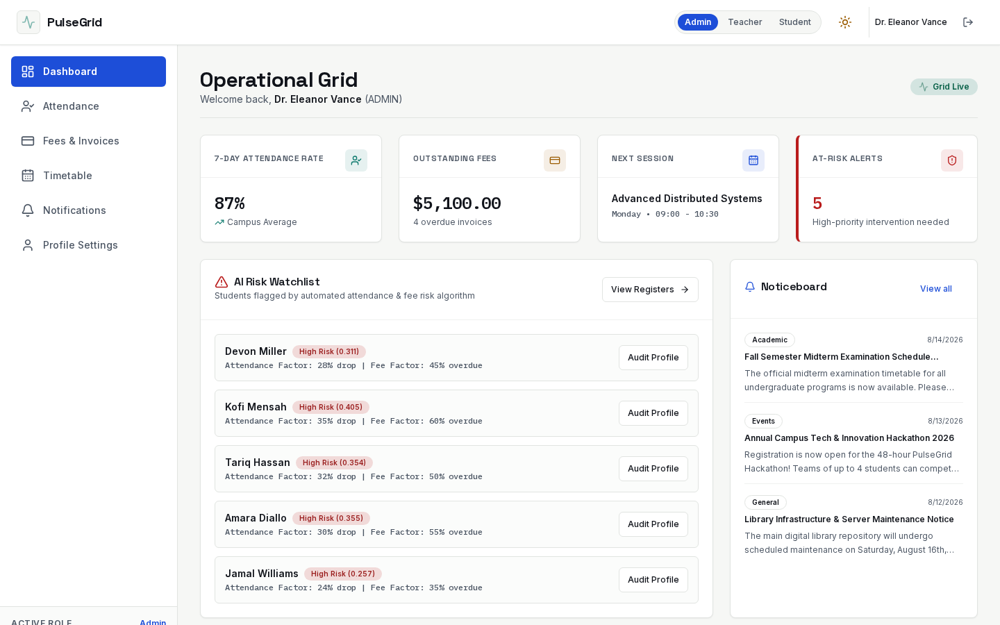
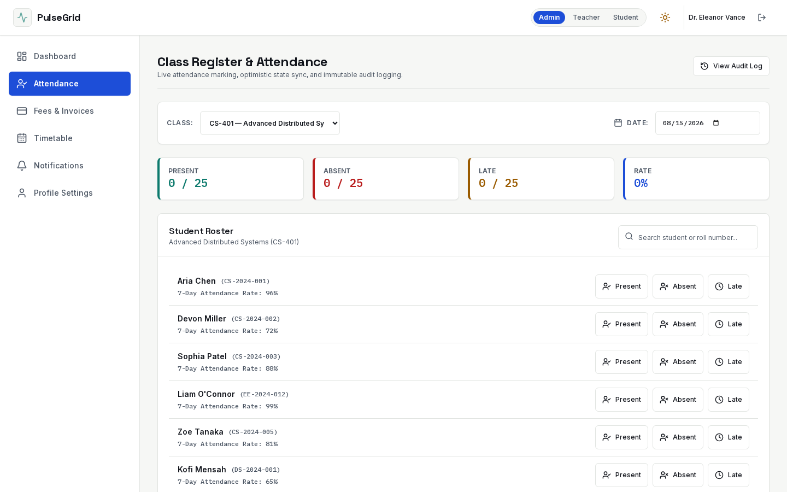
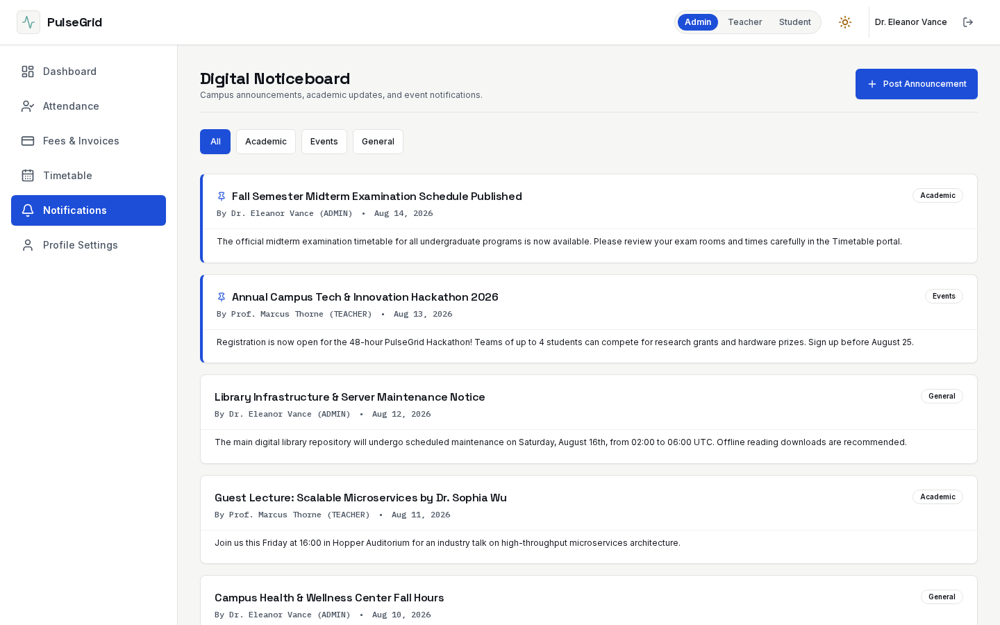
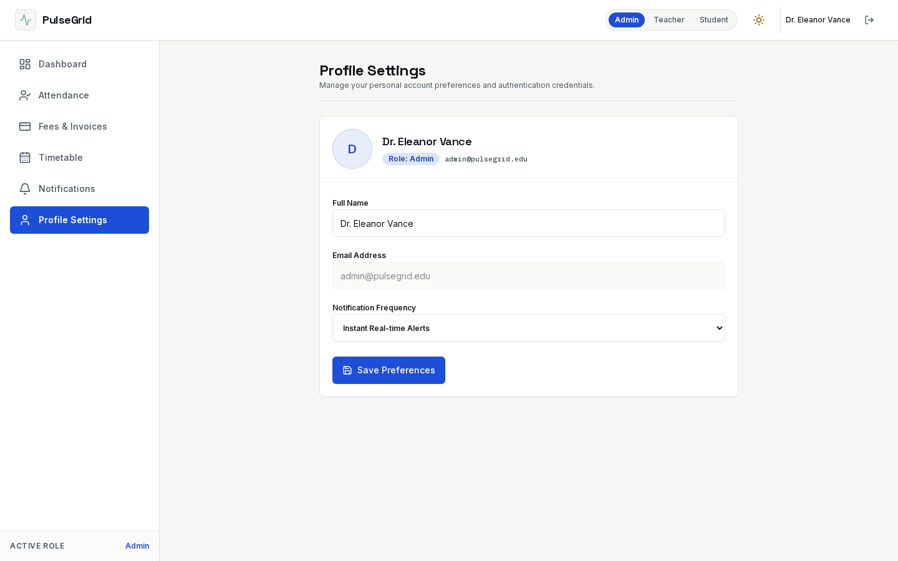

# PulseGrid
*"The heartbeat of your campus, in one grid."*

[](https://github.com/Ebendttl/PulseGrid)
[](LICENSE)
[](https://www.typescriptlang.org/)
[](https://nextjs.org/)
[](https://pulse-grid-sigma.vercel.app)

---

## Overview

**PulseGrid** is a production-grade, mobile-first Mini Student Information Management System (Mini-SIMS) Portal. It unifies four core operational modules — **Attendance**, **Fees & Invoices**, **Timetable**, and **Digital Noticeboard** — alongside an **AI-Powered Risk Scoring Engine** into a single role-aware cockpit dashboard for school administrators, faculty teachers, and students.

Treat every surface — architecture, naming, spacing, copy — as an instrument-grade cockpit display: precise, data-dense, and highly accessible.

---

## 🎨 Colour Palette & Design System

PulseGrid utilizes a dark-mode & light-mode tailored color system designed for high accessibility contrast ratio compliance (WCAG 2.1 AA >= 4.5:1 ratio):

| Color Token | Hex Code | Visual Swatch | Role / Usage |
|---|---|---|---|
| `--pg-signal-blue` | `#1D4ED8` | `🟦` | Primary actions, active navigation states, primary buttons |
| `--pg-pulse-teal` | `#0D7A6D` | `🟩` | Success indicators, high attendance rate, positive states |
| `--pg-alert-amber` | `#9A5B00` | `🟧` | Warning alerts, medium risk tiers, upcoming invoice notices |
| `--pg-risk-red` | `#B91C1C` | `🟥` | High risk alerts, overdue fees, absent records, destructive actions |
| `--pg-ink` | `#10131A` | `⬛` | Dark background / primary typography in light mode |
| `--pg-paper` | `#F6F7F5` | `⬜` | Page canvas background in light mode |
| `--pg-muted` | `#4B5563` | `🩶` | Subtitles, secondary metadata text, borders |

---

## 📸 Application Screenshots

### 1. Role-Aware Access Portal (`/login`)


### 2. Admin & Teacher Operational Dashboard (`/dashboard`)


### 3. Class Register & Attendance Marking (`/attendance`)


### 4. Campus Digital Noticeboard (`/notifications`)


### 5. Account Profile & Preferences (`/settings/profile`)


---

## Key Features

- ⚡ **Role-Aware Cockpit Grid:** Dynamic dashboard tailored for Admin, Teacher, and Student roles with instant role switching.
- 📋 **Optimistic Attendance Register:** Instant toggle for Present/Absent/Late status with automatic network failure rollback and immutable audit logging.
- 💳 **Fees & PDF Receipt Engine:** Invoice tracking, overdue indicators, Zod-validated payment processing, and downloadable PDF receipts via `html2pdf.js`.
- 📅 **Conflict-Aware Timetable:** Weekly schedule grid with automated interval-overlap conflict detection logic.
- 📢 **Digital Noticeboard:** Category-filtered announcements feed with background refetch and admin/teacher composer.
- 🤖 **AI Risk Scoring Engine:** Weighted operational risk analysis `(1 - attendance) * 0.5 + overdueFeeRatio * 0.3 + lateness * 0.2` bucketed into Low/Medium/High risk tiers with offline and API fallback paths.
- ♿ **WCAG 2.1 AA Accessibility:** 44×44px minimum tap targets, Radix primitives, high-contrast token system, and `prefers-reduced-motion` compliance.

---

## Tech Stack

| Layer | Technology |
|---|---|
| **Framework** | Next.js 15 (App Router with Server Components default) |
| **Language** | TypeScript 5.x (`strict: true`, `noUncheckedIndexedAccess: true`) |
| **Styling** | Tailwind CSS 4 with custom token design system |
| **UI Primitives** | shadcn/ui primitives backed by Radix UI |
| **State Management** | Redux Toolkit (`auth`, `attendance`, `finance`, `schedule`, `notifications`, `ui`) |
| **Server Cache** | TanStack Query v5 + Axios |
| **Mock Backend** | JSON Server (`db.json`) locally & Next.js Serverless API (`/api/data/*`) on Vercel |
| **Forms & Validation**| React Hook Form + Zod |
| **Testing** | Vitest + React Testing Library + Playwright E2E + axe-core |

---

## Demo Credentials

You can test all three role-based perspectives using the built-in role switcher in the navigation bar or from the `/login` portal:

| Role | Name | Demo Email | Capabilities |
|---|---|---|---|
| **Admin** | Dr. Eleanor Vance | `admin@pulsegrid.edu` | Full system access, audit log drawer, notice posting, risk watchlist |
| **Teacher** | Prof. Marcus Thorne | `teacher@pulsegrid.edu` | Attendance register marking, notice posting, timetable view |
| **Student** | Aria Chen | `student@pulsegrid.edu` | Personal academic overview, fee receipts, timetable, notices |

---

## Local Setup Instructions

### Prerequisites
- Node.js `v20.x` or higher
- `pnpm` `v10.x` or higher

### Installation & Launch

1. **Clone the repository:**
   ```bash
   git clone https://github.com/Ebendttl/PulseGrid.git
   cd PulseGrid
   ```

2. **Install dependencies:**
   ```bash
   pnpm install
   ```

3. **Start the development server & mock backend concurrently:**
   ```bash
   pnpm dev
   ```
   - Application URL: `http://localhost:3000`
   - JSON Server Mock API: `http://localhost:3001`

---

## Verification & Testing Suite

Execute the automated verification pipeline locally:

```bash
# Typecheck TypeScript codebase
pnpm typecheck

# Run ESLint check
pnpm lint

# Run Vitest unit & integration tests with 85%+ coverage gate
pnpm test

# Run Playwright End-to-End & axe-core accessibility suite
pnpm test:e2e

# Build production bundle
pnpm build
```

---

## License

Distributed under the [MIT License](LICENSE).
